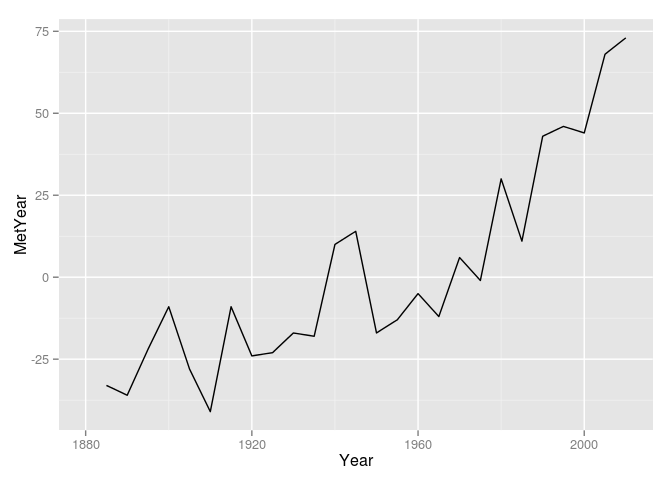

# Global Historical Temperatures
Rashan Jibowu  
08/02/2015  

## Introduction

x

## Set Up Environment


```r
library(plyr) 
library(ggplot2)
```

## Load the data


```r
# Data includes NA encodings as '***' and '****'
data <- read.csv("./data/ExcelFormattedGISTEMPDataCSV.csv", na.strings = c('***','****'))
```

Let's checkout the structure of the data


```r
str(data)
```

```
## 'data.frame':	136 obs. of  19 variables:
##  $ Year: int  1880 1881 1882 1883 1884 1885 1886 1887 1888 1889 ...
##  $ Jan : int  -29 -8 10 -32 -17 -64 -41 -65 -42 -19 ...
##  $ Feb : int  -19 -13 10 -41 -11 -29 -45 -47 -42 15 ...
##  $ Mar : int  -17 2 2 -17 -33 -23 -41 -31 -47 4 ...
##  $ Apr : int  -27 -2 -19 -23 -35 -44 -28 -37 -28 5 ...
##  $ May : int  -13 -3 -17 -24 -31 -41 -27 -33 -21 -3 ...
##  $ Jun : int  -28 -27 -24 -11 -37 -50 -39 -20 -20 -11 ...
##  $ Jul : int  -22 -5 -9 -7 -33 -28 -15 -18 -8 -5 ...
##  $ Aug : int  -6 -1 5 -12 -25 -27 -31 -27 -10 -18 ...
##  $ Sep : int  -16 -8 0 -18 -22 -19 -18 -19 -7 -18 ...
##  $ Oct : int  -15 -18 -21 -11 -22 -19 -25 -32 2 -22 ...
##  $ Nov : int  -18 -25 -20 -19 -30 -22 -26 -25 0 -30 ...
##  $ Dec : int  -20 -14 -24 -17 -28 -5 -24 -37 -11 -29 ...
##  $ J.D : int  -19 -10 -9 -19 -27 -31 -30 -33 -20 -11 ...
##  $ D.N : int  NA -11 -8 -20 -26 -33 -28 -32 -22 -9 ...
##  $ DJF : int  NA -13 2 -32 -15 -41 -30 -46 -40 -5 ...
##  $ MAM : int  -19 -1 -11 -22 -33 -36 -32 -33 -32 2 ...
##  $ JJA : int  -19 -11 -9 -10 -32 -35 -28 -21 -13 -11 ...
##  $ SON : int  -16 -17 -14 -16 -25 -20 -23 -26 -2 -23 ...
```

## Clean the data

Considering the struture of the data observed above, we'll need to do 2 things to make this data more usable:

1. Fix the formatting issue where several months are encoded as factors rather than integers
2. Clarify what `J.D`, `D.N`, `DJF`, `MAM`, `JJA`, and `SON` mean

### Fix Formatting


```r
# fix formatting (only useful when you don't include the na.strings argument when reading in the data)
data$Jul <- as.integer(data$Jul)
data$Aug <- as.integer(data$Aug)
data$Sep <- as.integer(data$Sep)
data$Oct <- as.integer(data$Oct)
data$Nov <- as.integer(data$Nov)
data$Dec <- as.integer(data$Dec)
data[['J.D']] <- as.integer(data[['J.D']])
data[['D.N']] <- as.integer(data[['D.N']])
data[['DJF']] <- as.integer(data[['DJF']])
data[['JJA']] <- as.integer(data[['JJA']])
data[['SON']] <- as.integer(data[['SON']])

# check the structure again
str(data)
```

```
## 'data.frame':	136 obs. of  19 variables:
##  $ Year: int  1880 1881 1882 1883 1884 1885 1886 1887 1888 1889 ...
##  $ Jan : int  -29 -8 10 -32 -17 -64 -41 -65 -42 -19 ...
##  $ Feb : int  -19 -13 10 -41 -11 -29 -45 -47 -42 15 ...
##  $ Mar : int  -17 2 2 -17 -33 -23 -41 -31 -47 4 ...
##  $ Apr : int  -27 -2 -19 -23 -35 -44 -28 -37 -28 5 ...
##  $ May : int  -13 -3 -17 -24 -31 -41 -27 -33 -21 -3 ...
##  $ Jun : int  -28 -27 -24 -11 -37 -50 -39 -20 -20 -11 ...
##  $ Jul : int  -22 -5 -9 -7 -33 -28 -15 -18 -8 -5 ...
##  $ Aug : int  -6 -1 5 -12 -25 -27 -31 -27 -10 -18 ...
##  $ Sep : int  -16 -8 0 -18 -22 -19 -18 -19 -7 -18 ...
##  $ Oct : int  -15 -18 -21 -11 -22 -19 -25 -32 2 -22 ...
##  $ Nov : int  -18 -25 -20 -19 -30 -22 -26 -25 0 -30 ...
##  $ Dec : int  -20 -14 -24 -17 -28 -5 -24 -37 -11 -29 ...
##  $ J.D : int  -19 -10 -9 -19 -27 -31 -30 -33 -20 -11 ...
##  $ D.N : int  NA -11 -8 -20 -26 -33 -28 -32 -22 -9 ...
##  $ DJF : int  NA -13 2 -32 -15 -41 -30 -46 -40 -5 ...
##  $ MAM : int  -19 -1 -11 -22 -33 -36 -32 -33 -32 2 ...
##  $ JJA : int  -19 -11 -9 -10 -32 -35 -28 -21 -13 -11 ...
##  $ SON : int  -16 -17 -14 -16 -25 -20 -23 -26 -2 -23 ...
```

### Rename variables

According to the data source, NASA's Goddard Institute for Space Studies, its [FAQs](http://data.giss.nasa.gov/gistemp/FAQ.html) explain what the shorthand variables mean.

> When comparing seasonal temperatures, it is convenient to use "meteorological seasons" based on temperature and defined as groupings of whole months. Thus, Dec-Jan-Feb is the Northern Hemisphere meteorological winter, Mar-Apr-May is N.H. meteorological spring, Jun-Jul-Aug is N.H. meteorological summer and Sep-Oct-Nov is N.H. meteorological autumn. String these four seasons together and you have the meteorological year that begins on Dec. 1 and ends on Nov. 30.

So, let's encode accordingly


```r
data <- rename(data, c('DJF'='Winter', 
                       'MAM'='Spring', 
                       'JJA'='Summer', 
                       'SON'='Autumn',
                       'J.D'='CalYear',
                       'D.N'='MetYear'))

str(data)
```

```
## 'data.frame':	136 obs. of  19 variables:
##  $ Year   : int  1880 1881 1882 1883 1884 1885 1886 1887 1888 1889 ...
##  $ Jan    : int  -29 -8 10 -32 -17 -64 -41 -65 -42 -19 ...
##  $ Feb    : int  -19 -13 10 -41 -11 -29 -45 -47 -42 15 ...
##  $ Mar    : int  -17 2 2 -17 -33 -23 -41 -31 -47 4 ...
##  $ Apr    : int  -27 -2 -19 -23 -35 -44 -28 -37 -28 5 ...
##  $ May    : int  -13 -3 -17 -24 -31 -41 -27 -33 -21 -3 ...
##  $ Jun    : int  -28 -27 -24 -11 -37 -50 -39 -20 -20 -11 ...
##  $ Jul    : int  -22 -5 -9 -7 -33 -28 -15 -18 -8 -5 ...
##  $ Aug    : int  -6 -1 5 -12 -25 -27 -31 -27 -10 -18 ...
##  $ Sep    : int  -16 -8 0 -18 -22 -19 -18 -19 -7 -18 ...
##  $ Oct    : int  -15 -18 -21 -11 -22 -19 -25 -32 2 -22 ...
##  $ Nov    : int  -18 -25 -20 -19 -30 -22 -26 -25 0 -30 ...
##  $ Dec    : int  -20 -14 -24 -17 -28 -5 -24 -37 -11 -29 ...
##  $ CalYear: int  -19 -10 -9 -19 -27 -31 -30 -33 -20 -11 ...
##  $ MetYear: int  NA -11 -8 -20 -26 -33 -28 -32 -22 -9 ...
##  $ Winter : int  NA -13 2 -32 -15 -41 -30 -46 -40 -5 ...
##  $ Spring : int  -19 -1 -11 -22 -33 -36 -32 -33 -32 2 ...
##  $ Summer : int  -19 -11 -9 -10 -32 -35 -28 -21 -13 -11 ...
##  $ Autumn : int  -16 -17 -14 -16 -25 -20 -23 -26 -2 -23 ...
```

## Explore the data

#### Deviations in Calendar Year


```r
ggplot(data, aes(x = Year, y = CalYear)) + geom_line()
```

```
## Warning in loop_apply(n, do.ply): Removed 1 rows containing missing values
## (geom_path).
```

 

#### Deviations in Meteorological Year


```r
ggplot(data, aes(x = Year, y = MetYear)) + geom_line()
```

```
## Warning in loop_apply(n, do.ply): Removed 2 rows containing missing values
## (geom_path).
```

 

#### Deviations in Meteorological Year (Scatter Plot)


```r
ggplot(data, aes(x = Year, y = MetYear)) + geom_point()
```

```
## Warning in loop_apply(n, do.ply): Removed 2 rows containing missing values
## (geom_point).
```

 


#### Deviations by Season


```r
ggplot(data, aes(x = Year)) + 
    geom_line(aes(y = Winter, colour = "Winter")) + 
    geom_line(aes(y = Summer, colour = "Summer")) +
    geom_line(aes(y = Autumn, colour = "Autumn")) +
    geom_line(aes(y = Spring, colour = "Spring"))
```

```
## Warning in loop_apply(n, do.ply): Removed 1 rows containing missing values
## (geom_path).
```

```
## Warning in loop_apply(n, do.ply): Removed 1 rows containing missing values
## (geom_path).
```

```
## Warning in loop_apply(n, do.ply): Removed 1 rows containing missing values
## (geom_path).
```

 

#### Deviations by Season (Scatter)


```r
ggplot(data, aes(x = Year)) + 
    geom_point(aes(y = Winter, colour = "Winter")) + 
    geom_point(aes(y = Summer, colour = "Summer")) +
    geom_point(aes(y = Autumn, colour = "Autumn")) +
    geom_point(aes(y = Spring, colour = "Spring"))
```

```
## Warning in loop_apply(n, do.ply): Removed 1 rows containing missing values
## (geom_point).
```

```
## Warning in loop_apply(n, do.ply): Removed 1 rows containing missing values
## (geom_point).
```

```
## Warning in loop_apply(n, do.ply): Removed 1 rows containing missing values
## (geom_point).
```

 

## Visualize the data

Specify a year range and a "season" to display


```r
visualize <- function(yearRange, season = "CalYear") {
    
   ggplot(data[data$Year %in% yearRange, ], aes(x = Year)) +
       aes_string(y = season) + 
       geom_line()
}

visualize(seq(1880, 2010, 5), "MetYear")
```

```
## Warning in loop_apply(n, do.ply): Removed 1 rows containing missing values
## (geom_path).
```

 
